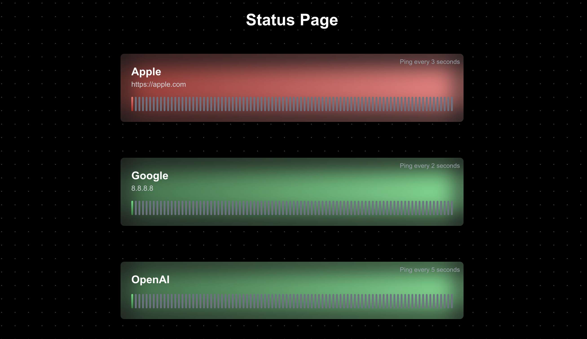

# statisfaction

<p align="center">
    
    
    
</p>

<p align="center" width="100%">
    
</p>

## How to Run

You can run this project either using Docker or natively (with Node.js). Choose the method that suits your environment.

1. **Running with Docker**

The easiest way to run the project is by using Docker Compose. This will handle both the backend and frontend services in one go.

```bash
docker compose up -d
```

This command will start the application in detached mode.

2. **Running Natively (with Node.js)**

If you prefer running the project without Docker, you can set it up locally by following these steps:

```bash
cd backend && npm install && cd ../frontend && npm install && cd ..
node backend/server.js & npm --prefix frontend run dev
```

Now, the application should be running locally! Access it through your browser at <http://localhost:3000> (or any other port specified in your setup).

## Editing the Config File

The configuration for this project is stored in a JSON file, which you can edit to customize the behavior of the service monitoring. Here's an example of the [default config](https://github.com/rbourgeat/statisfaction/blob/main/config.json).

> [!NOTE]
> The application will automatically detect the changes and apply them in real time, allowing you to update the status page on the fly!

<details>
<summary>Breakdown of the Config File</summary>

- `configs`: This section includes general settings for the status page.
    - `title`: The title of your status page.
    - `incidentReportDelay`: The time delay (in seconds) before an incident report is triggered.
- `services`: This section lists the services being monitored.
    - `name`: The name of the service.
    - `address`: The address or URL of the service.
    - `pingInterval`: The interval (in seconds) at which to check the service's availability.
    - `showIp`: Whether or not to show the IP address of the service.
- `repository`: Contains the repository information if you are linking to a GitHub or GitLab project.
    - `platform`: The platform used (GitHub or GitLab).
    - `owner`: The repository owner (e.g., GitHub username or organization name).
    - `repo`: The repository name.
    - `assignee`: A list of usernames or user ids.
    - `authToken`: The authentication token used to access the repository (replace with your actual token).
</details>