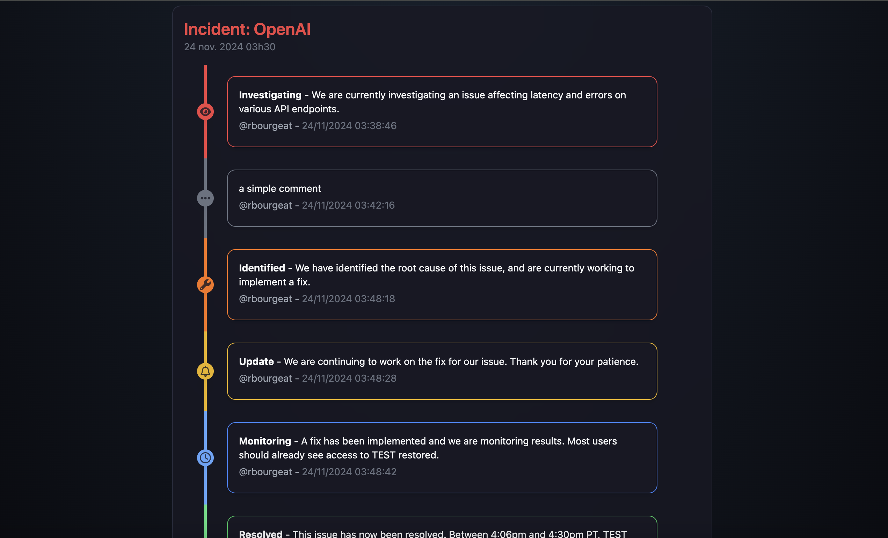

# statisfaction

<p align="center">
    
    
    
</p>

<p align="center" width="100%">
    
</p>

## How to Run

You can run this project either using Docker or natively (with Node.js). Follow the instructions below to get started.

1. **Running with Docker**

**Steps:**

- Clone the repository and navigate to the project directory.

- Run the following command to start the services:

```bash
docker compose up -d
```

**Building the Docker Image Locally:**

If you want to build the Docker image locally instead of pulling from a registry, use the following commands:

```bash
docker compose build
docker compose up -d
```

2. **Running Natively (with Node.js)**

To run the project without Docker, you can set it up locally:

```bash
cd backend && npm install && cd ../frontend && npm install && cd ..
node backend/server.js & npm --prefix frontend run dev
```

Access the application through your browser at <http://localhost:3000> (or another port, depending on your setup).

## Editing the Config File

The configuration for this project is stored in a JSON file. You can customize the behavior of the service monitoring by editing the [config.json](https://github.com/rbourgeat/statisfaction/blob/main/config.json).

> [!NOTE]
> Changes to the config file are applied in real-time, so the status page updates instantly.

<details>
<summary>Breakdown of the Config File</summary>

- `configs`:
    - `title`: The title of your status page.
    - `description`: A brief description displayed under the title.
    - `incidentReportDelay`: The time delay (in seconds) before an incident report is triggered.
- `services`:
    - `name`: The name of the monitored service.
    - `address`: The IP or URL of the service.
    - `pingInterval`: Frequency (in seconds) for checking service availability.
    - `showIp`: Whether or not to show the IP address of the service.
    - `expectedStatusCode`: Set the expected status code (default: 200).
    - `verifySSL`: Boolean to specify whether the SSL certificate should be verified when accessing HTTPS services.
    - `platform`: The platform used (GitHub or GitLab).
    - `owner`: The repository owner (e.g., GitHub username or organization name).
    - `repo`: Repository name.
    - `url`: Optionally specify a custom GitLab URL.
    - `assignee`: Usernames to assign to incident reports.
    - `authToken`: Authentication token (replace with your token).
</details>

## Incidents

<p align="center" width="100%">
    
</p>

### Features

- **Automatic Incident Creation**: Incidents are automatically opened as issues in your GitLab or GitHub repository.

- **Custom Assignee**: You can configure the assignee for issues by editing the [config.json](https://github.com/rbourgeat/statisfaction/blob/main/config.json).

- **Timeline Integration**: Each comment on an issue is displayed (in real time) as an event in the incident timeline on the status page.

- **Keyword-Based Styling**: Specific keywords in issue comments trigger custom styles in the incident timeline, making it easy to track progress.

### Keyword Styling

To customize the appearance of comments on the status page timeline, include one of the following keywords in your comment:

- Investigating

- Identified

- Update

- Monitoring

- Resolved

Each keyword corresponds to a unique style, helping users quickly identify the current status of an incident.
